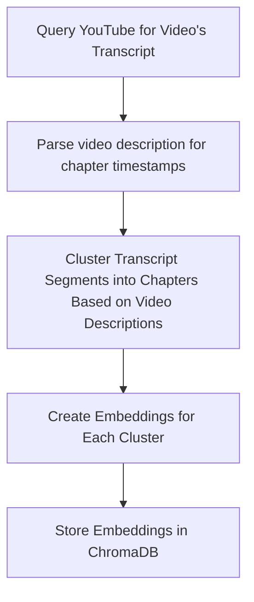
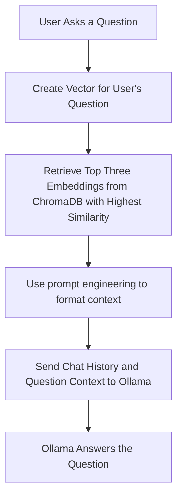
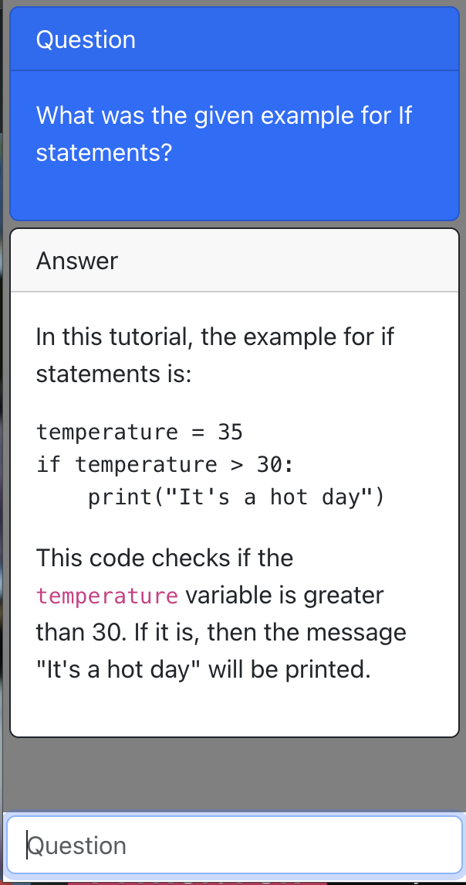

# GPT for Youtube Video

This is a Chrome extension that enables users to ask questions about YouTube videos as they watch them.

## Table of Contents

- [Design](#design)
  - [Embedding Process] (#embedding-process)
  - [Retrieval Process] (#retrieval-process)
- [Backend](#backend)
  - [Technologies](#technologies)
    - [Ollama](#ollama)
    - [ChromaDB](#chromadb)
    - [Docker](#docker)
    - [Flask and Python](#flask-and-python)
  - [API Docs](#api-docs)
    - [`POST /api/chat`](#post-apichat)
    - [`GET /api/load_transcript/<video_id>`](#get-apiload_transcriptvideo_id)
  - [Running Locally](#running-locally)
- [Frontend](#frontend)
  - [User Interface](#user-interface)
  - [Running Locally](#running-locally-1)

## Design

### Embedding Process



### Retrieval Process



## Backend

The backend of the Youtube-Q-A-Chatbot project is responsible for handling the API requests that interact with the RAG model pipeline to generate responses using open source self-hosted LLMs.

### Technologies

#### Ollama

> Ollama is a platform that manages setting up and running open source and custom LLMs. In this project, Ollama is hosted in the VT Discovery Kubernetes Cluster and is running Meta's Llama3 and Llama2, and Mistral. LLama3 is used to create the embedding for the youtube transcripts, which are stored in ChromaDB, and is used to query context to provide to the LLM that generates responses to the user's prompted questions.

#### ChromaDB

> ChromaDB is the vector database that is used in this project. ChromaDB creates a collection for each youtube video. Each collection, stores the youtube video's transcripts in chunk, each chunk's embedding, and metadata regarding which part of the video each chunk corresponds to. When a question is asked, the vector db is queried for the chuck with the highest similarity. That chuck is used as context to answer the user's questions.

#### Docker

> Docker is used in the project to containerize the core components of the project and docker-compose is used to easily bring up the required containers and define the networking rules to allow the containers to interact.

#### Flask and Python

> Flask and Python are used to handle API requests and process the chat history. Flask is a lightweight web framework in Python that allows for easy routing and handling of HTTP requests. Python, being a versatile programming language, provides the necessary tools and libraries to process the chat history and generate responses using open source self-hosted LLMs. Together, Flask and Python form the foundation of the backend architecture, enabling seamless communication between the frontend and the LLM models.

### API Docs

#### `POST /api/chat`

This endpoint takes in the chat history of the current session and returns the LLMs response to the question.

| Parameter  | Type     | Description                                     |
| :--------- | :------- | :---------------------------------------------- |
| `messages` | `array`  | **Required**. Array of user's messages          |
| `video_id` | `string` | **Required**. ID of Youtube Video               |
| `model`    | `string` | Optional. Model for chat (default: llama2:chat) |

##### Example body

```json
{
  "messages": [
    {
      "role": "user",
      "content": "User's message"
    }
  ],
  "model": "mistral" // Optional, default is "llama3"
}
```

#### Success Response

**Code:** `200 OK`

**Content:**

```json
{
  "text": "Assistant's response",
  "source_tags": ["source_tag_1", "source_tag_2"],
  "source_documents": ["source_document_1", "source_document_2"]
}
```

#### Error Response

**Code:** `500 Internal Server Error`

**Content:**

```json
{
  "error": "Error message"
}
```

#### `GET /api/load_transcript/<video_id>`

This endpoint loads a given youtube video's transcript in ChromaDB (vectorDB).

| Parameter  | Type     | Description                       |
| :--------- | :------- | :-------------------------------- |
| `video_id` | `string` | **Required**. Id of youtube video |

#### Success Response

**Code:** `200 OK`

**Content:**

```json
{
  "status": "video newly loaded" // or "video already added"
}
```

#### Error Response

**Code:** `500 Internal Server Error`

**Content:**

```json
{
  "error": "Error message"
}
```

### API Docs

```http
  POST /api/chat
```

This endpoint takes in the chat history of the current session and returns the LLMs response to the question.
| Parameter | Type | Description |
| :--------- | :------- | :---------------------------------------------- |
| `messages` | `array` | **Required**. Array of user's messages |
| `model` | `string` | Optional. Model for chat (default: llama2:chat) |

##### Example body

```json
{
  "messages": [
    {
      "role": "user",
      "content": "User's message"
    }
  ],
  "model": "mistral" // Optional, default is "llama3"
}
```

#### Success Response

**Code:** `200 OK`
**Content:**

```json
{
  "text": "Assistant's response",
  "source_tags": ["source_tag_1", "source_tag_2"],
  "source_documents": ["source_document_1", "source_document_2"]
}
```

#### Error Response

**Code:** `500 Internal Server Error`
**Content:**

```json
{
  "error": "Error message"
}
```

---

```http
  GET /api/load_transcript/<video_id>
```

This endpoint loads a given youtube video's transcript in ChromaDB (vectorDB)

| Parameter  | Type     | Description                       |
| :--------- | :------- | :-------------------------------- |
| `video_id` | `string` | **Required**. Id of youtube video |

#### Success Response

**Code:** `200 OK`
**Content:**

```json
{
  "status": "video newly loaded" // or "video already added"
}
```

#### Error Response

**Code:** `500 Internal Server Error`
**Content:**

```json
{
  "error": "Error message"
}
```

### Running Locally

#### Prerequisites

- Docker
  - `docker-compose`

The backend runs in several containers that are configured to be able to see and communicate with one another.

```bash
cd backend
```

```bash
docker compose up --build
```

This runs the `flask server`, `chromaDB` (vector database), and `ollama` (LLMs).

All backed services are ready and running when the flask service is running (see bellow for example).

```bash
api       |  * Serving Flask app 'app'
api       |  * Debug mode: off
api       | WARNING: This is a development server. Do not use it in a production deployment. Use a production WSGI server instead.
api       |  * Running on all addresses (0.0.0.0)
api       |  * Running on http://127.0.0.1:5001
api       |  * Running on http://172.26.0.3:5001
api       | Press CTRL+C to quit
```

## Frontend

### User Interface

<div style="display: flex;">
  
  
</div>

### Running Locally

Prerequisites

- NodeJS
- `yarn`

```bash
cd frontend
```

```bash
yarn build
```

This creates a directory-- `build`

1. Navigate to Chrome
2. Go to `chrome://extensions/`
3. click `Load unpacked`
4. Select the newly created `build` directory
5. Navigate to a youtube video and open the chrome extension
